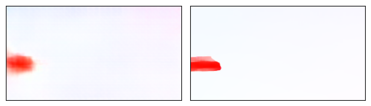
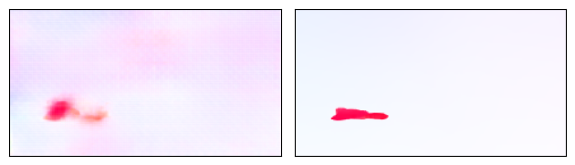

# Optical Flow Estimation using Flownet for custom dataset

Dataset Link: https://drive.google.com/drive/folders/19lFm_kM4mUkD3q-hOqI9LVRJqqZf4qPH?usp=drive_link

Pretrained Checkpoint: https://github.com/ClementPinard/FlowNetPytorch/blob/master/weights/flownets_bn_EPE2.459.pth

**Requirements:** pytorch

To run download the checkpoint and dataset then

```
python main.py
```
## Results 
### Predicted and Ground Truth Flows




